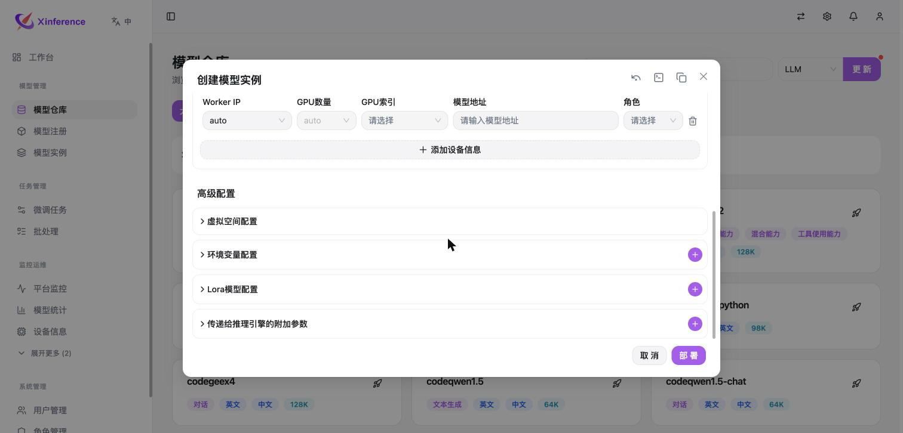
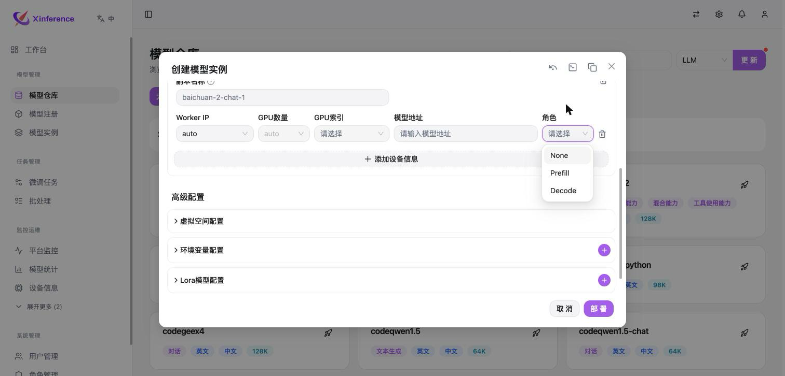

===============================
Prefill–Decode disaggregation
===============================

Separate prompt processing from token generation so long prefill work does not repeatedly interrupt decode batches. Xavier transfers the KV cache between replicas and maintains a shared per-model block tracker for cross-replica prefix reuse.

.. container:: docs-metadata

   :Backend: vLLM 0.23
   :Connector: Xavier V1
   :Validated model: Qwen3

Compatibility scope
=====================

.. important::

   This guide describes the supplied validation record, not a promise of support in every release. Qwen3 was tested on hardware with the backend and connector versions above.

.. list-table:: Recorded compatibility
   :header-rows: 1

   * - Model architecture
     - Recorded result
   * - Attention-only models
     - Qwen3 was validated. The record also lists Qwen2.5, Llama-3.1, GLM-4, QwQ and DeepSeek-R1-Distill as applicable model families; they were not all individually validated in this record.
   * - Hybrid linear-attention / SSM models
     - Qwen3.5 and Qwen3.6 produced garbled output in this configuration. Do not use them with this recorded Xavier V1 setup.

Check the model configuration for ``linear_attention`` entries in ``layer_types`` or a ``full_attention_interval`` field. The recorded Xavier path moves token-block KV data; hybrid models also have recurrent state that needs different handling.

Configure replica roles
=========================

1. Open the model registry and select the rocket icon on the model card to create an instance.
2. Choose the vLLM engine, model version and model source.
3. Add at least two device rows under replica configuration. Assign one Prefill role and one Decode role, with explicit worker addresses and different GPU indices.
4. Review advanced engine parameters and deploy the instance.

   Replica configuration and advanced engine settings in the deployment form.

   Choose a role for each device row.

.. list-table:: Device roles
   :header-rows: 1

   * - Role
     - Responsibility
   * - None
     - Ordinary deployment without PD disaggregation.
   * - Prefill
     - Process the prompt and produce the initial KV cache.
   * - Decode
     - Generate subsequent tokens using the transferred state.

.. code-block:: text
   :caption: Two-device example

   Prefill / GPU 0  -- Xavier KV transfer -->  Decode / GPU 1

Engine settings
=================

Keep Prefill and Decode on separate GPUs. The recorded shared-GPU environment used ``gpu_memory_utilization=0.8`` to leave room for other containers; choose the value from available memory rather than treating it as a universal default. The Xavier V1 path in this record enables ``enforce_eager=True`` automatically.

Validate inference and transfers
==================================

Confirm both roles are running, then use greedy decoding to inspect coherent output. A successful HTTP response alone does not establish that KV transfer is correct.

.. code-block:: bash
   :caption: Greedy decoding check

   curl -s http://<host>:<port>/v1/chat/completions \
     -H "Authorization: Bearer <API_KEY>" \
     -H "Content-Type: application/json" \
     -d '{
       "model": "qwen3",
       "messages": [{"role": "user", "content": "Introduce Hangzhou in one sentence."}],
       "max_tokens": 50,
       "temperature": 0,
       "stream": false
     }'

Inspect logs for Xavier block staging, sending and receiving, and for the remote decode/prefill flags. Repeated newlines or garbled text in the recorded hybrid-model setup indicate invalid transferred state; sampling can obscure the symptom.

.. code-block:: text
   :caption: Transfer indicators from the validation record

   Stage / Send / Recv Xavier V1 blocks
   do_remote_decode=True
   do_remote_prefill=True

Known limitations
===================

The original record mentions fixes for non-streaming responses, BF16 transfer precision and stale block registrations. It does not identify their released image version. Confirm the deployed version contains those fixes before relying on the corresponding behavior.

Related guides
================

* :doc:`../xinference_images/performance`
* :doc:`../troubleshooting/index`
